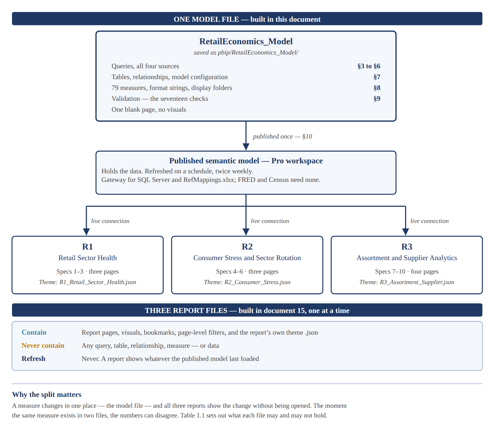
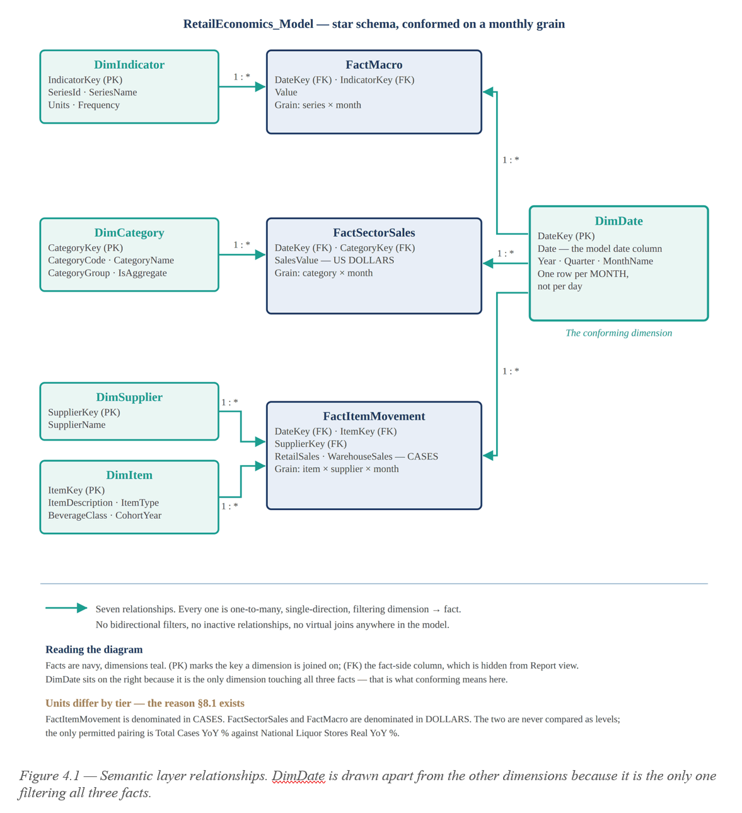
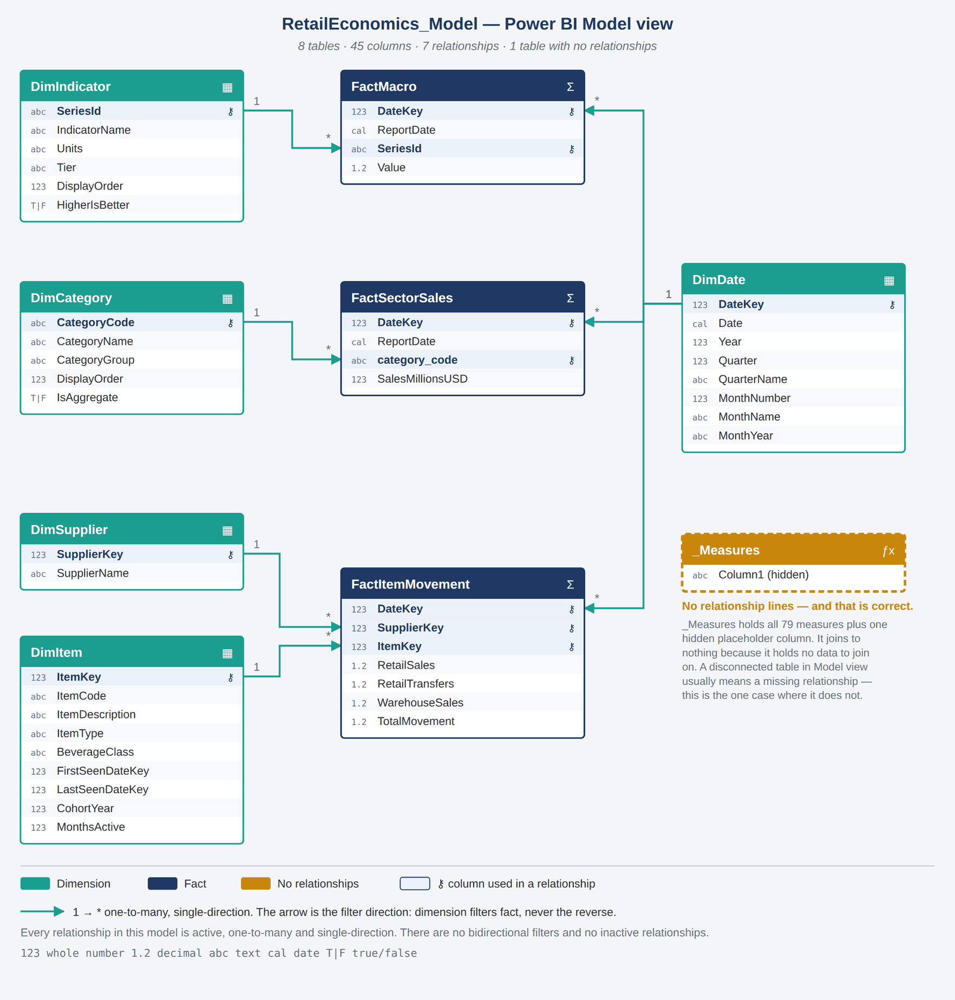
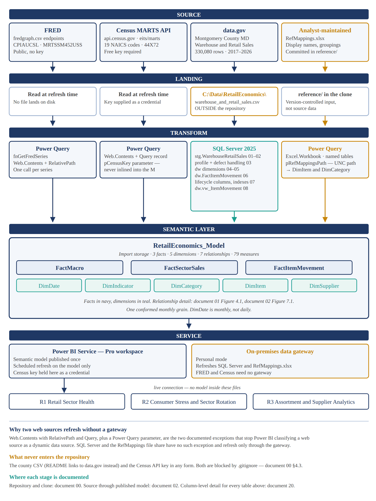

# U.S. Retail Sector Health - Power BI
 
Three Power BI reports on one shared semantic model, tracing U.S. retail
from national macro conditions to item-level physical movement.

This project analyzes the health of the U.S. retail sector with
reproducible data workflows, a validated semantic model and a complete
documentation set. It is built by one developer, end to end - from the
SQL Server warehouse to the published reports - and it is designed to
show that working independently does not mean working without QA,
review or documentation.
 
## Reports

## Power BI Files structure

 
## Data model

## Semantic model

## Pipeline diagram

 
## Highlights
- Three ingestion patterns in one model: keyed REST API (Census MARTS),
  on-premises SQL Server (330,080 rows), and a governed Excel reference file
- One published semantic model, three live-connected thin reports
- Physical case volume reconciled against nominal dollar sales by
  deflating the national series - not by comparing levels
- PBIP source control: every DAX change is a readable line diff
 
## Working as an independent developer
Solo projects and lean teams rarely have a separate QA function or a
reviewer waiting on every change. The developer has to:
- test their own work, at the point where each defect is cheapest to find
- make assumptions explicit and check them against the source
- document the work for people who were not there when it was built
- ship without waiting for a peer review that is not coming

This project is built for that reality. Its QA is planned, written down
and recorded rather than assumed.

### How the work is checked
- **Validation gates, not a final test.** Ten gates run from repository
  setup to packaging. Each names the checks that must pass before the
  next phase starts - a SQL script's row count, a measure folder's
  closing check, a report page's review.
  See [document 25](docs/25_Validation_Timing_Guide.docx) and its
  checklist, [document 26](docs/26_Validation_Timing_Checklist.xlsx).
- **Seventeen pre-publication checks, in two passes.** Twelve test the
  data and measures before the model is published; five test the report
  pages before each report is published. Every run is recorded with its
  date and observed values in
  [document 22](docs/22_Validation_Results.xlsx), and a failure stays
  open until a later run re-verifies it.
- **Re-validation after the build.** A data reload, an edited measure or
  a changed visual each has a defined set of checks to re-run, so the
  reports stay correct after the day they were finished.
- **Checks anyone can repeat.** The SQL and DAX checks are written out
  ready to paste, so a reviewer can re-run them and get the same answer.

### How the work is made reproducible
- The eight scripts in sql/ rebuild the warehouse from the public CSV,
  in order, with no manual step.
- Everything machine-specific is isolated: the SQL Server name, and
  Power Query parameters for the Census API key and the location of
  RefMappings.xlsx. The key is never committed.
- The model and reports are saved as PBIP, so every measure change is a
  readable diff in the commit history.
- One shared semantic model means one definition of every number: a
  measure changes in one place and all three reports follow.

### How the work is documented
- A numbered document set in docs/ runs from the project plan (01)
  through data setup (02), report specifications (15), the data
  dictionary (20) and glossary (23) to validation (22, 25, 26).
- Design decisions are recorded where they are made, with the reason -
  why the date dimension is monthly, why cases and dollars are never
  compared as levels, why the reports carry no measures of their own.
- Limitations are stated on this page and in document 01 section 8,
  not left for a reviewer to discover.

### AI-assisted review
With no second developer, an AI assistant stands in as reviewer. It is
used to challenge assumptions, to check claims against primary sources -
Microsoft Learn and the Census and FRED documentation - and to look for
contradictions across the document set. The developer reviews and
approves every change before it is committed, and every document states
how AI assistance was used.

In practice this review has caught cross-references pointing at the
wrong section, a diagram showing the wrong SQL script numbers and a
mislabelled query file - the kind of errors a second pair of eyes
exists to find.

## Data sources (not redistributed here)
- Census MARTS API: https://api.census.gov/data/timeseries/eits/marts
- FRED: https://fred.stlouisfed.org/
- Montgomery County item movement:
  https://catalog.data.gov/dataset/warehouse-and-retail-sales
 
## Repository map
| Folder | Contents |
|---|---|
| docs/ | Numbered documentation set (00, 01, 02, 12, 13, 14, 15, 20, 21, 22, 23, 25, 26) |
| sql/ | Warehouse build scripts, run 01 through 08 in order |
| powerquery/ | M source for the API and file queries |
| dax/ | Measure catalog by display folder |
| pbip/ | Power BI Project text - the diffable source |
| pbix/ | Four binaries: model + three reports |
| reference/ | RefMappings.xlsx |
| theme/ | Report theme JSON |
| assets/ | Page and model screenshots |
 
## Limitations
Item-level data covers one Maryland county and one product category;
it is used for grain, not for national inference. Regression coefficients
are descriptive, not inferential. See docs/01 section 8.
